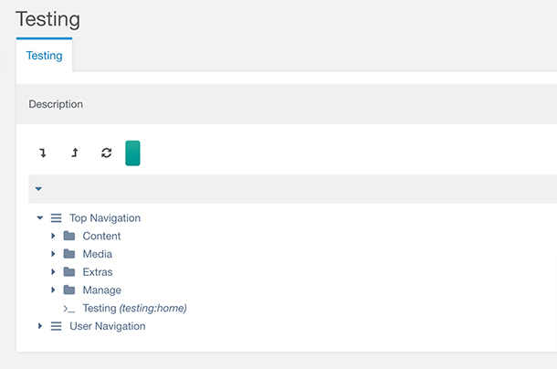
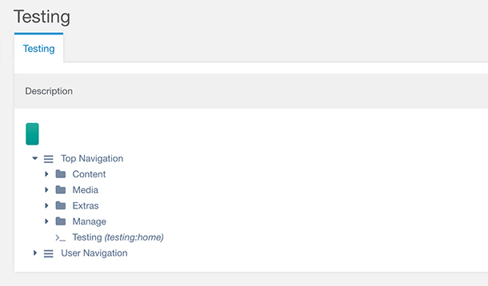
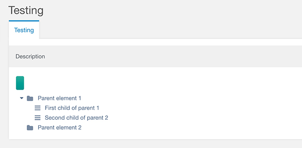
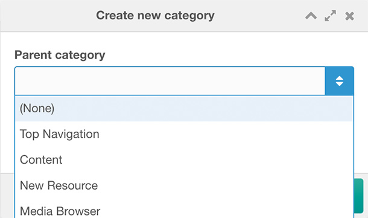
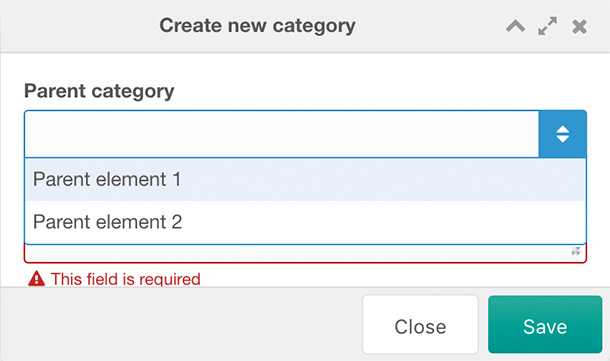
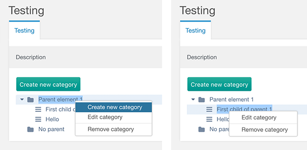
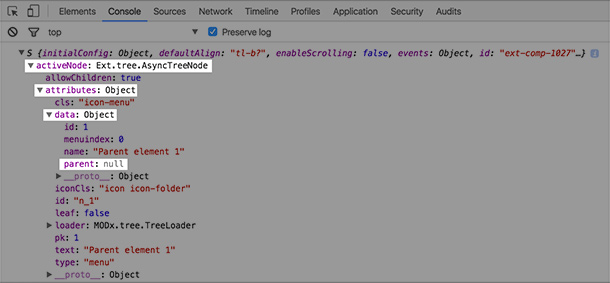

|||Published: Yes
|||Title: Using Ext JS to create neat manager pages in no time
|||Posted: 29.08.2016 12:21
|||Edited:

I might have oversold this with my Tweet, but I felt that I should share how I worked with Ext JS to create a manager interface for a project I worked on this summer.

Here goes my article, presentation, showcase, tutorial, or whatever you'd like to call it. Presented in seven chapters (hello Tarantino).

### Chapter 1 - Introducton

The background for writing this is that I feel like Ext JS gets a lot of undeserved hate. Sure, it is a complex framework, there is a LOT of magic going on, and it does not help that MODX Revolution is currently on version 3.4 when their latest major release is 6. Despite all this, I truly belive that Ext JS has in some ways benefited MODX and the manager panel. I think that the code powering the manager would be much more confusing in a lot of other technologies.

#### Short introduction to Ext JS

If you are not too familiar with Ext JS and how it is used in the manager, let me give you a quick introduction. Ext JS is a framework that focuses on components. Once a component is defined, this component can extended further and new functionality can be built on top of existing ones. This way we can reuse a lot of functionality which results in less code.

Ext JS is written by basically defining a HUGE JavaScript object that more or less draws the entire DOM for you. Ext JS translates this nested object that consists of components inside other components inside other components and draws everything out during rendering. The downside of this is that much of the work you usually do in Ext JS feels very abstract as you are not interacting with any DOM objects directly, you are assuming that Ext JS does its job and there is something in the mess of a DOM tree that matches what you expect. Another downside is that just a single error, like a forgotten comma, will lead to the entire tree of components crashing and not rendering.

Below is a very simple introduction code:

```
// Define our object with a config
My.object = function(config) {
    config = config || {};
    
    // We can add attributes to our config here
    Ext.apply(config, {
        foo: 'bar'
    };
    
    // Calling the constructor for our superclass
    My.object.superclass.constructor.call(this, config);
};

// Here we tell Ext JS that My.object is extending the component MODx.Panel
Ext.extend(My.object, MODx.Panel, {
    // Optional things can go here, like methods or special behavior
});

// Finally let us register our object in a unique ID that can be embedded later
Ext.reg('my-code', My.object);
```

### Chapter 2 - The task at hand

I worked on a project this summer. In this project I was asked to create a system for categories. This system needed support for two levels of categories, primary and secondary ones. Primary categories are the "root" categories, while secondary categories have primary categories as their parents. To supplement this, it was also requested functionality to drag and drop the categories to reorder and restructure the hierarchy. Functionality to expand and collapse the primary categories would also be a plus, as we would work with many categories. Other functionality such as possibility to add, edit and remove categories was also needed and had to be implemented.

Creating something like this could be pretty easily done in jQuery or other libraries or frameworks, but we wanted to integrate it in the manager panel with the rest of our custom manager pages. This meant that the most logical thing to do was to implement it in Ext JS.

Following this blog post, you can see the exact code I wrote and used in my GitHub repository. It has different branches for the various stages throughout this post. You can find the entire repository at [OptimusCrime/modx-category-cmp](https://github.com/OptimusCrime/modx-category-cmp/branches).

### Chapter 3 - Getting started with the component

With the task defined and fleshed out, I started looking at what type of components could be used to create functionality like the one we needed. Drag and drop? Expand and collapse? Hm, this does indeed sound a lot like menus and trees! Menus and trees are found many places in the manager and is extended from a central Ext JS component.

The trees and menus I found in the Manager includes:

- Resource menu
- Elements menu
- Files menu
- Top menu administration
- Access controll list administration
- Property set administration
- The file browser

If you look at how these trees and menus behave and how they look, it is clear the MODX reuses the same base functionality in many of these components. I wanted to base my component on one of these and extend my code further to implement the features I needed.

#### Browsing the MODX source code for leads

The next step was to go through the MODX source and look at how each of these components were implement and extended in the original Ext JS code. The idea was to find a components that was not too complex and did not have too many features that we had to remove or override.

The relevant MODX source for the MODX Ext JS implementations lives in the [manager/assets/modext](https://github.com/modxcms/revolution/tree/2.x/manager/assets/modext) directory. From here the directories are divided between:

- **core** - The core MODX components that overrides and extends the Ext JS components. Holds the most central components that are reused multiple times in the manager.
- **sections** - The base sections for the various views in the Manager.
- **util** - Various utilities and reusable snippets of Ext JS code.
widgets - The widgets that are included in the base sections. This can be grids, windows, trees, panels and more.
- **workspace** - I really don't know what this directory is used for, but it contains more Ext JS code for various parts of the Manager.

I browsed the various locations where this tree/menu behavior is found in the Manager, and inspected the corresponding Ext JS code that it used. I found out which files this was by inspecting the source code and looking at which JavaScript files were included in the various sections. One of the simplest of these tree components turned out to be [modx.tree.menu.js](https://github.com/modxcms/revolution/blob/e1d0f054d1ac5431e93008aaca517f93a39667ee/manager/assets/modext/widgets/system/modx.tree.menu.js). While the entire implementation is more than 300 lines long, it is relatively simple in nature. 

At this point I had basically two choices: either extending the tree used for the menus, or copy the content of this file and trim it more and more until I got the functionality I needed. Extending the menu tree would create a hierarchy like this:

```
Ext.tree.TreePanel -> MODx.tree.Tree -> MODx.tree.Menu -> Category.Tree
```

But the `MODx.tree.Menu` had too many features that I had to deal with. I instead decided to not extend the menu tree, resulting in this hierarchy:

```
Ext.tree.TreePanel -> MODx.tree.Tree -> Category.Tree
```

Where `Category.Tree` initially was a 100% duplicate of the MODx.tree.Menu source code.

#### Cutting and trimming

Below is the current Category.Tree at this stage. As you can see, it is exactly the same menu as you find in the manager interface under Menus. You can browse the exact and complete code I used for creating this component at [OptimusCrime/modx-category-cmp/stage1](https://github.com/OptimusCrime/modx-category-cmp/tree/stage1).



The next task was to remove the parts of the component from the source code that I did not want and that was not relevant in my case. I made the following changes in `home.tree.js`:

```
[...]
,rootVisible: false
[...]
,useDefaultToolbar: false
[...]
```

Okey, cool. We got rid of some of the stuff we did not need. 



### Chapter 4 - Creating processor endpoints

The next step was to change the content of the component. Right now it uses the processors for the menu which fetches the menus we have defined for the manager interface. I would like to swap these for our own endpoints that provide the category data.

Before we swap the endpoints I needed to know what format the tree expects the data to come in. I had to figure out how Ext JS takes the JSON response and draws the tree nodes. I inspected this by using the Chrome inspector and looked at the various ajax calls that were fired upon refreshing the page containing the menu. There were multiple requests running after each other, each fetching a part of the tree. The first request fetched the root menus (the ones without any parents). The form data was:

- **action**: system/menu/getNodes
- **node**: n_

And the response was:

```
[
    {
        "text": "Top Navigation",
        "id": "n_topnav",
        "cls": "icon-menu",
        "iconCls": "icon icon-navicon",
        "type": "menu",
        "pk": "topnav",
        "leaf": false,
        "data": {
        "text": "topnav",
        "parent": "",
        "action": "",
        "description": "topnav_desc",
        "icon": "",
        "menuindex": 0,
        "params": "",
        "handler": "",
        "permissions": "",
        "namespace": "core",
        "childrenCount": "5"
        },
        "qtip": ""
    }, [...]
]
```

Similarly, the request for the children of the menu item "Top Navigation" had the following form data:

- **action**: system/menu/getNodes
- **node**: n_topnav

And response was:

```
[  
    {  
        "text": "Content",
        "id": "n_site",
        "cls": "icon-menu",
        "iconCls": "icon icon-folder",
        "type": "menu",
        "pk": "site",
        "leaf": false,
        "data": {  
            "text": "site",
            "parent": "",
            "action": "",
            "description": "",
            "icon": "",
            "menuindex": 0,
            "params": "",
            "handler": "",
            "permissions": "menu_site",
            "namespace": "core",
            "childrenCount": "6"
        },
        "qtip": ""
    }, [...]
]
```

We can easily see the pattern and how we should recreate the response to build our own processor for the categories. Ext JS first asks for the root elements, then assigns each of them an `id`. This `id` is used to fetch the children (if any) by sending the `id` as the value for the `node` data. If the `node` data was `n_` it meant we were fetching the root elements.

You can see how I adjusted the Ext JS and wrote my own processor in [OptimusCrime/modx-category-cmp/stage2](https://github.com/OptimusCrime/modx-category-cmp/tree/stage2), specifically the file [getnodes.class.php](https://github.com/OptimusCrime/modx-category-cmp/blob/stage2/core/components/testing/processors/mgr/getnodes.class.php) under processors.



With a similar approach I also created a processor that deals with the sorting of the elements. You can see this code in [sort.class.php](https://github.com/OptimusCrime/modx-category-cmp/blob/stage2/core/components/testing/processors/mgr/sort.class.php), also under processors. With the sort processor in place, we also have functionality to drag and drop categories onto, below, and above each other. This greatly illustrates the power of Ext JS. We'll get back to some minor tweaks we'll have to do regarding the sorting later.

You can browse the entire difference between the [stage1...stage2](https://github.com/OptimusCrime/modx-category-cmp/pull/1/files) to see what changes were done to create this functionality. As you can see, it is not a whole lot of code.

Note: I know that this part of the article is a lot of "magic", but there is not too much to comment really. You'll need to look at the original processors and understand how they work. Look at how the processors extends their parent classes and what "magically" happens behind the scenes. A good starting point is looking at the get og getList processors for a endpoint in the manager. Look at the code and which methods are overridden. It will make a whole lot of sense after some debugging.

### Chapter 5 - New, edit and remove

The next step was to add functionality to create a new category, edit an existing category or remove a category. This section illustrates the power of Ext JS and you'll see just how much we can rely on the magic of the processors and their shorthand classes.

#### Create new category

Creating a new category is done via a popup box. This box was already in place for the menu functionality. Implementing the same for categories was pretty easy. You can see the steps taking in the difference between [stage2...stage3](https://github.com/OptimusCrime/modx-category-cmp/pull/2/files). However, we are not yet finished. The combobox for parents still lists manager menu entries from the original code.



I wrote a new processor for the combobox that fetches the primary categories and wrote a processor that creates our new category. The latter contains some logic to keep track of menuindexes, but should not be too complex. You can see the code for these steps in [stage3...stage4](https://github.com/OptimusCrime/modx-category-cmp/pull/3/files). You can browse the entire code up to this point at [OptimusCrime/modx-category-cmp/stage4](https://github.com/OptimusCrime/modx-category-cmp/tree/stage4).



#### Editing an existing category

I already have functionality to create a new category at this point. The operation for editing is more or less identical to creating. The next code block is the only thing we needed to write in Ext JS to add edit functionality. Of course I still needed to hook the code on right click action and write the processor, but the window that pops up when you are updating is no more than these lines of code:

```
/**
 * This code overrides the window used to create a new category.
 */
Testing.window.UpdateCategory = function(config) {
    config = config || {};
    Ext.applyIf(config, {
        title: _('testing.category_update')
        ,baseParams: {
            action: 'mgr/update'
            ,id: config.record.id
        }
    });
    Testing.window.UpdateCategory.superclass.constructor.call(this, config);
};

// Note that we extend Testing.window.CreateCategory here!
Ext.extend(Testing.window.UpdateCategory, Testing.window.CreateCategory);
Ext.reg('testing-window-category-update', Testing.window.UpdateCategory);
```

I belive that this greatly illustrates how you can use Ext JS code more than once with only minor adjustments. Fuctionality like this is also very common. If you need to create something you'll most likely need to edit it somehow too. You can see the rest of the changes done to fully implement functionality to edit a category in [stage4...stage5](https://github.com/OptimusCrime/modx-category-cmp/pull/4/files) or browse the entire code at [OptimusCrime/modx-category-cmp/stage5](https://github.com/OptimusCrime/modx-category-cmp/tree/stage5).

#### Remove a category

The final piece of the puzzle is to add support for removing a category from the system. This code for removing menu elements is already present, and only slight modifications were needed. In the processor I also took care of deleting children of primary categories,. This leads to some additional code, but it is mostly a straight forward removal processor. You can see the difference at [stage5...stage6](https://github.com/OptimusCrime/modx-category-cmp/pull/5/files).

### Chapter 6 - Cleanup and final adjustments

During development this was, we have ignored a few things that might results in problems or bugs. The component should only support two levels of categories, and disable creating categories deeper in the tree. Right now it had support to create child categories of secondary categories. It also allowed dropping a primary category onto a secondary category, which would produce three levels of categories if allowed. It would, in addition, be nice to be able to add a secondary category if we right clicked on a primary category.

#### Right click to directly create a secondary category

The method `getMenu` is the one that draws the context menu when you right click something in our tree. This method decides which options to display to the user. I rewrote it a bit to add support for our new functionality.

```
The new method looks like this:
,getMenu: function(n, e) {
    var m = [];
    
    // If the node we right click on has no parent, allow to create a category here
    if (n.attributes.data.parent == null) {
        m.push({
            text: _('testing.category_create')
            ,handler: this.createCategory
        });
    }
    
    // We're always going to allow updating a category
    m.push({
        text: _('testing.category_update')
        ,handler: this.updateCategory
    });
    
    // This is simply a separator in the menu
    m.push('-');
    
    // At the bottom we'll have the "dangerous" stuff
    m.push({
        text: _('testing.category_remove')
        ,handler: this.removeCategory
    });
    
    return m;
}
```

In the method `createCategory` I needed to make sure it pass the `parent` value if sat. There was already some code trying to take care of that, but because our data is slightly different from the original code, I needed to adjust it like so:

```
var r = {
    parent: null
};
if (this.cm && this.cm.activeNode && this.cm.activeNode.attributes && this.cm.activeNode.attributes.data) {
    r['parent'] = this.cm.activeNode.attributes.data.id;
}
```



People may ask, "how the hell do you know which attributes exists and which ones to compare?". Well, truth is that stuff like this is mostly done by trial and error. I `cosole.log` out all the variables I have available and try to navigate myself though the Ext JS object mess to the correct attributes I need to extract in order to make something useful happen. After a while you'll get the hang of this and you'll know what to look for. I did the same in the next section there I had no code to base my functionality on. In the picture below, I have `console.log`'ed out the content of `this.cm` to see what it contains. Simply traversing it is not very difficult.



#### Disallow dropping primary categories onto secondary categories

This was a bigger problem. I had no code to go from to solve this, but fear not. I already knew that there had to be a ton of functionality tied to dragging and droppig nodes in the trees we were extending. As I found no code that could help me in the source code for `MODx.tree.Menu`, I tried to go one level up to `MODx.tree.Tree`. The code for this component resides in [modx.tree.js](https://github.com/modxcms/revolution/blob/e1d0f054d1ac5431e93008aaca517f93a39667ee/manager/assets/modext/widgets/core/tree/modx.tree.js). Around the lines [modx.tree.js#L538-L548](https://github.com/modxcms/revolution/blob/e1d0f054d1ac5431e93008aaca517f93a39667ee/manager/assets/modext/widgets/core/tree/modx.tree.js#L538-L548) I hit jackpot. Worth noting that I was unsure if the correct method to override was `_handleDrop` or `_handleDrag`. I did some testing before I found out which one was fired and which attributes and data I could access in each of them.

The code says it all. This is again a result of trial and error. I logged the output of the event and tried dropping categories onto each other, below each other and so forth. After that I inspected the output from the logs and tried to make sense in how I could differentiate between the various states. The following code disables dropping a category onto another if it has children and the target is a secondary category.

```
,_handleDrop: function(dropEvent) {
    // Let's shortcut things
    var drop_node = dropEvent.dropNode;
    var traget_node = dropEvent.target;
    
    // If the event is "append" we are just adding a new child in a list, not ON a parent, hence we can ignore it
    if (dropEvent.point == 'append') {
        return false;
    }
    
    // If our drop node has children AND the target node's parent is not the "root" we are attempting to drop at
    // another node, which results in too many levels of categories. Simply returning false here will disable dropping
    // in this position
    if (traget_node.parentNode.id != 'root' && drop_node.childNodes.length > 0) {
        return false;
    }
    
    // This is just the code from modx.tree.js to implement some basic functionality
    if (!Ext.isEmpty(drop_node.attributes.treeHandler)) {
        var h = Ext.getCmp(drop_node.attributes.treeHandler);
        if (h) {
            return h.handleDrop(this, dropEvent);
        }
    }
}
```

And that is it, really. You can see all the changes from the previous stage at [stage6...stage7](https://github.com/OptimusCrime/modx-category-cmp/pull/6/files) or browse the entire code at [OptimusCrime/modx-category-cmp/stage7](https://github.com/OptimusCrime/modx-category-cmp/tree/stage7).

At this point we're done with out component. Sure we can add more functionality, but for the sake of illustrating the process from start to finish, I think this will do. If you want to see more, download the GitHub code from the stage7 branch and install it yourself. Instructions are in the README.md file.

### Chapter 7 - Final thoughts

It might not have been the easies article, presentation, showcase, tutorial or whatever to follow, but I hope someone learned a thing or two. I did not target people that have developed tons of custom manager pages before. I hope they already are aware of how powerful Ext JS is alread. I wrote this for people that has only been watching Ext JS from the outside with fear and anger. I do understand why many dislike Ext JS and would like to get rid of it, but while it is an integrated part of the manager you might as well learn it and use it for what it's worth.

I've spent many hours debugging stupid blank manager pages because of some dumb syntex error, or gotten so deep in the Ext JS source code that I was afraid I would never get out again. Ext JS is difficult, too difficult perhaps, but I honestly think you can learn it if you decide to do so. I for one am glad I can provide customers with integrated and friendly components directly in the MODX manager as a part of our solutions.

I'd like to thank [Catch Media](http://www.catchmedia.no/) for allowing me to reuse some of the code I wrote in their project for this article.

Feel free to comment or share!