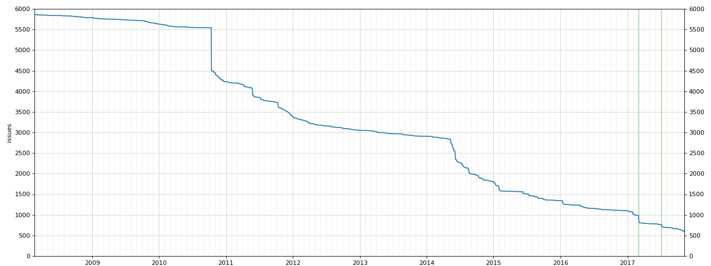

|||Published: Yes
|||Title: The MODX Issue Tracker Still Needs Some Love
|||Posted: 08.11.2017 23:53
|||Edited:

About two years ago I wrote a blog post called [Help MODX! Take care of some issues at GitHub](https://optimuscrime.net/11-help-modx!-take-care-of-some-issues-at-github). It was actually the first blog post I ever posted on my website. In this post, I urged people to take to the issue tracker at [GitHub](https://github.com/modxcms/revolution/issues) and start cleaning. Back in 2015 there were, according to my post, 1.4k open issues in the MODX repository.

We have done a _lot_ of cleaning since then, and the number of open issues right now is **588**. Even more impressive, the total number of closed issues is over **5.2k**! I have compiled the progress into the graph below. The graph displays the number of open issues that are still residing in the bug tracker today. See notes at the end of the post for calculation details. The vertical green lines indicate the dates for the first and second [MODX bughunt](https://www.modxbughunt.com), held at March 3rd, 2017 and July 7th, 2017. As reflected in the graph, these hunts did a solid dent in the number of open issues, which I think is pretty awesome.

We have worked hard for years to get where we are today, but we are not done yet! 600 open issues is still a lot, and the number of open issues is not proportional to the number of pull requests, forks and stars the repository has. We want this to change! More pull requests, more followers, and most importantly; fewer open issues. Issues and bugs are reported every day, and this is to be expected for a popular software like MODX, but the issues should be dealt with swiftly. Instead, they just gather dust on the 15th page of the issue tracker.

Do your share! Pick up a broom and start cleaning with us. The list below is stolen from my post two years ago:

- **Outdated tickets** - Some tickets are many years old and refer to stuff that is no longer valid. 
- **Incorrect tickets** - Same as above.
- **Tickets that lack information** - "It does not work". Well, it works here, what is wrong? Without further information, nothing can be done.
- **Tickets dealing with Extras** - Should not be a ticket in the MODX Core. Link to the correct repo.
- **Tickets where the issue is user/server error** - If something is not correctly configurated, it will not work. That is not MODXs fault
- **Suggestions that you disagree with** - There are many good ideas for new functionality, but not everything deserves to be a part of the MODX core.
- **Duplicates** - Many issues deals with the same problem. Tag duplicates with #[github-issue-id] to reference it.

*Technical about the graph calculation:* The calculation was done with a simple Python script ([modx_issues.py](static/34/modx_issues.py)). I realize after implementing it that it has a few shortcomings. The script only takes into account the number of total issues, not the time they were opened. This means that there were most likely fewer issues open than reflected in the graph. I am thinking about expanding the current code to take the date the issue was opened into account. This could also populate two other graphs: progression of opened issues and the total number of open issues at any day. I will look at this in a future post.

Feel free to comment or share this blog post.